# Using a Wacom Tablet to Draw in Illustrator
by Autumn Scott

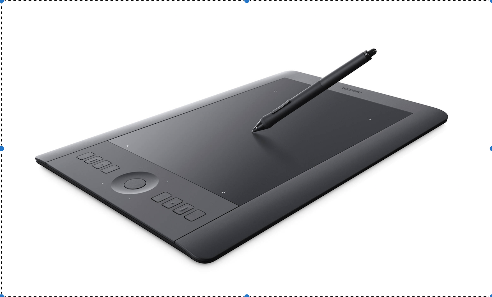

## Why You Should Use a Tablet
Wacom tablets have become a must have tool for professional illustrators. If you’re reading this document, odds are you're probably interested in building your skills as an illustrator. This instructional tutorial is intended to give proper background knowledge to new users so that they feel comfortable with a Wacom drawing tablet. For anyone who is serious about illustration, I recommend learning to use a drawing tablet because it is an essential skill to have in the professional world. It will make you easier to sell to future employers. Plus, who wouldn't like the idea of sketching on a crazy futuristic notepad device, anyway? Also, employers will expect a professional illustrator to know how to use a tablet. Although they may seem scary at first, once you're familiar with them, they will make your life easier. Many illustrators prefer tablets opposed to traditional media because of it’s natural “pencil and paper” feel. It is easier for an artist to create images with a pencil-like device rather than a mouse. 

Listed below are steps to guide you through the process of setting up a Wacom tablet and learning to use it within a creative app, such as illustrtator. This process will begin with the basics of making sure you have contemporary software and end with instructions on how to create a finished illustration.

## Download the Most Recent Driver
Before we dive into drawing with the wacom tablet, there's a few things we need to get set up. First, close down all of your applications on your computer, connect the wacom tablet to your computer via the usb cable, then make sure you have the latest driver for your tablet downloaded onto your computer. 

#### To find the most recent driver go to this page:

https://www.wacom.com/en-us/support/product-support/drivers

Once you have downloaded the driver, it's time to get your wacom tablet preferences set up!

## Step One - Setting Up Preferences

Okay, bare with me, because I know this stuff is boring. If youre looking down at your Wacom Tablet in a state of confusion, wondering what all of those little buttons on the side do, fear no more. You've come to the right place! Those little buttons are "Express Keys," and they are there to make your life easier! So, what we want to do is get these little boogers set up, because let's be honest, we want to get to the fun drawing part already! Okay, so there are two ways to navigate to the wacom settings. One is to go through the apple system preferences located at the top left hand corner of any mac. The second is to go through the wacom desktop center. When first setting up the tablet I recommend using the wacom desktop center. It has more areas of control and gives you extras such as the marketplace and store. Later on, if you are looking to tweak or edit your wacom preferences quickly, I recommend going through the apple menu.

Okay, so open your launchpad, and then navigate to the wacom desktop center icon. It should be a white circle with a blue "w." Click on it! Once you've got it open, your screen should look like the picture shown below.

### Your Wacom Desktop Center:

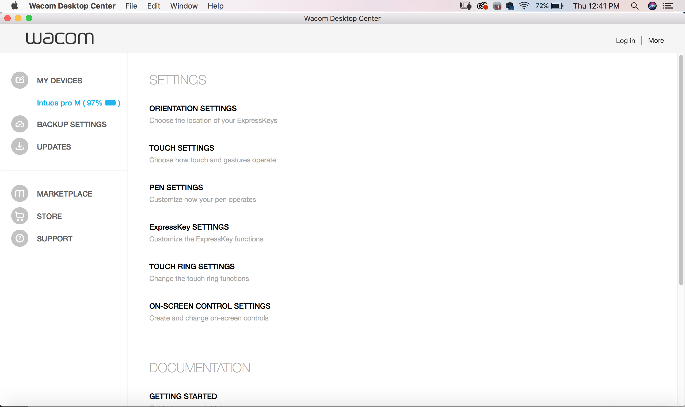

The Wacom Desktop Center allows you access to your preferences, your backup settings, updates, the wacom marketplace, the store, and support fot the tablet. I think it's important to familiarize yourself with this center before using the tablet.

After you've got the desktop center open, click on the first tab at the top on the left "My Device." You should see to the right of that the name of your device. Mine says Intuos Pro M. Click on the name and then a list of your settings will pop up. Begin making your way through the list setting your own personal preferences to each control. Everyone's settings will look different from one another. It all depends on which applications your using and which hand is your dominate hand. The first section listed under the settings portion of the desktop center is "Orientation Settings." This is simply you telling your tablet which hand you'll be operating with. As you make your way down the list you'll come across the orientation settings, touch settings, pen settings, express key settings, touch ring settings, and the on-screen control settings. Once you've set up your settings it's time to get started in illustrator.

## Step Two - Setting Up Your Brushes In Illustrator

When you first get started in Illustrator you want to make sure that you have your tools set up correctly so that you get the most authentic tablet drawing experience possible. There's nothing more frustrating than when you feel like you aren't getting an authentic result because your tools aren't set up correctly. You want your paintbrushes to paint as if you were physically holding them, the more pressure the wider the stroke. So first, we are going to set up our brushes to paint with "pressure" rather than a "fixed" setting. 

To set up pressure settings with your paint brush go to the window menu, scroll down to brushes, open the dropdown menu in the top right hand corner of the panel, and then select brush options (Excuse my unfinished cowboy illustration, I'm currently working on a project). Once you've selected brush option, change all of the settings from fixed to pressure. Now you will have a more realistic painting experience when using your paintbrushes in illustrator. 

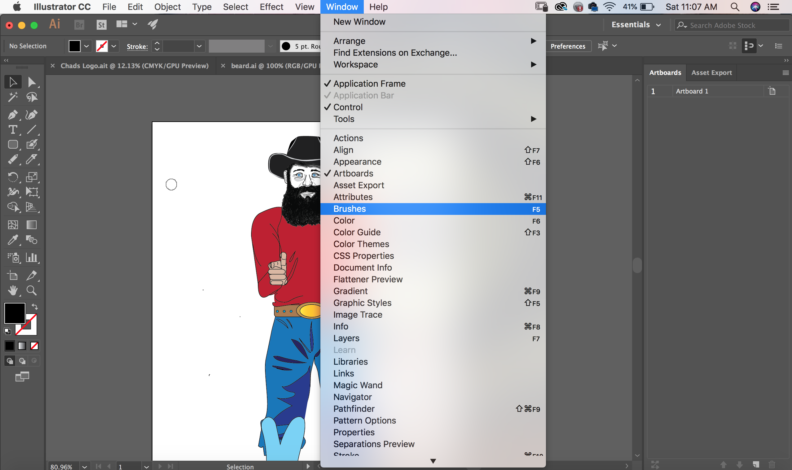

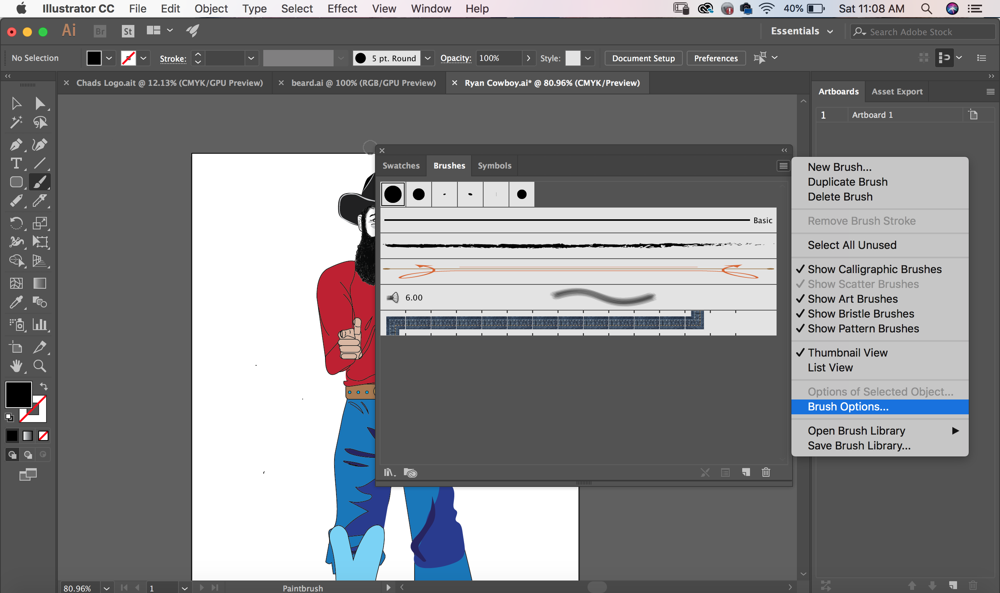

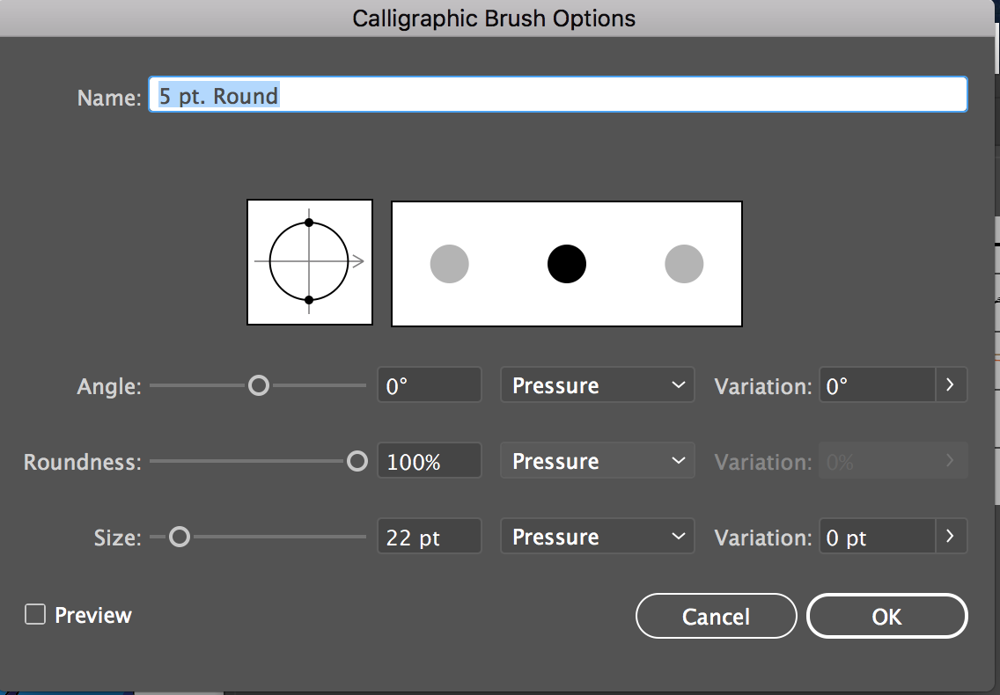

## Step Three - Drawing In Illustrator

Now that we've got our brushes set up, it's time to start creating in Illustrator. Most illustrators create their artwork within layers. First, they will begin sketching their subject with the pencil tool. This will be on the bottom layer, while the finished more polished artwork will be on the top layers.  

### Start sketching on a Blank Layer

For the sake of time, I have provided images below of someone else's artwork to represent the process of drawing with a wacom tablet. Below you will see how this particular illustrator makes their rough sketch of the character. Don't fret too much about sketching out each line perfectly. We're going to come back on top of this layer anyway.

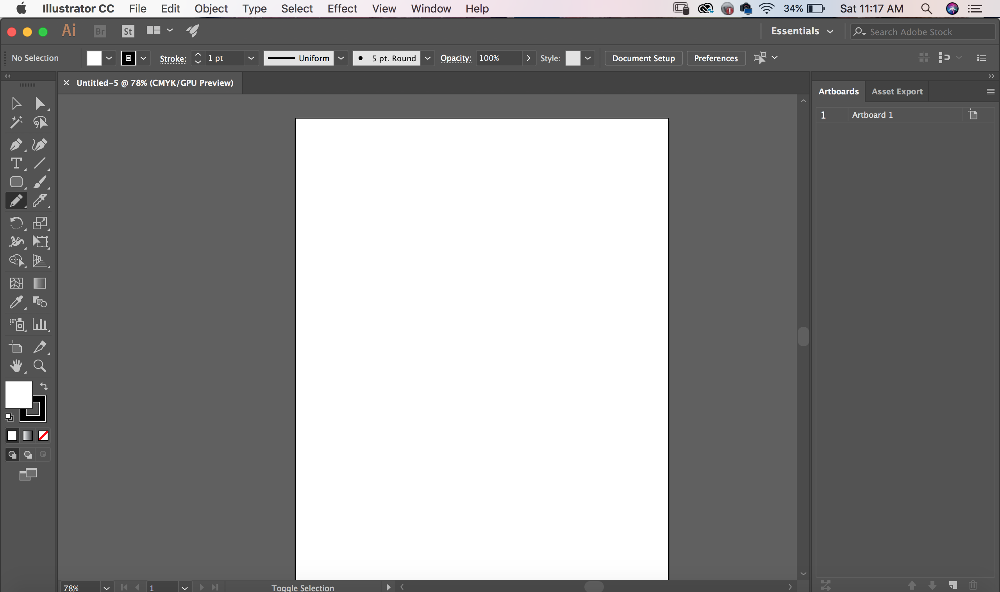

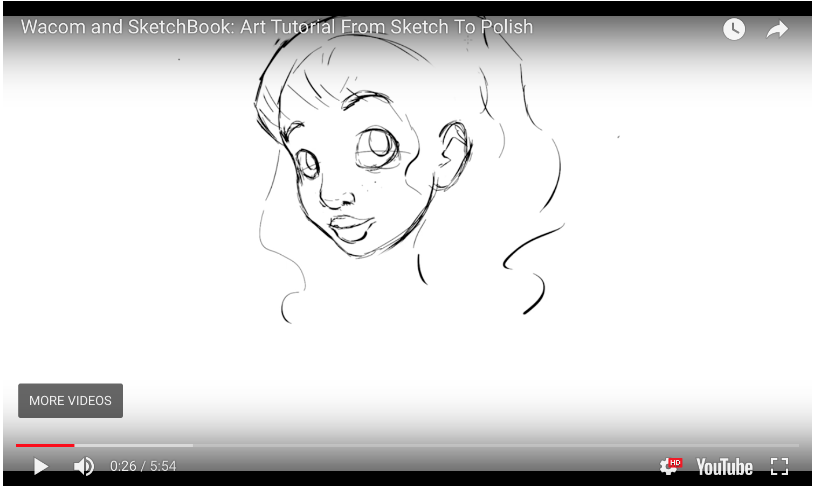

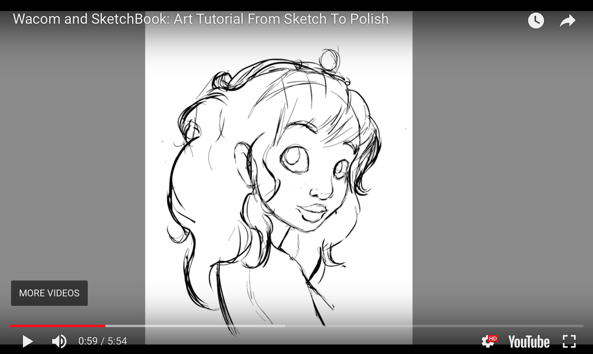

## Step Four- Turn Down Opacity and Create Line Art

After you've got a pretty good sketch drawn out, turn down your opacity on the sketched layer. Create a new layer and draw over the sketch using bold strokes. This makes the sketch appear to be more finished. In order to keep your layers organized I recommend giving them titles such as sketch, and line art. This way you can toggle back and forth between layers without any confusion.

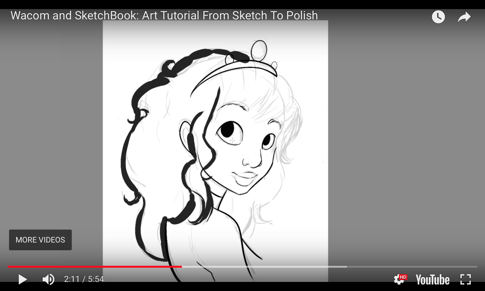

## Step Five - Add Color

After you've finished your line art, start adding basic colors to your sketch. Start out with a base color and then add shadows and highlights. Add highlights on various parts of the face and in the hair. The more time you spend mapping out where to put highlights and shadows, the more realistic your illustration will be. Detail! Detail! Detail!

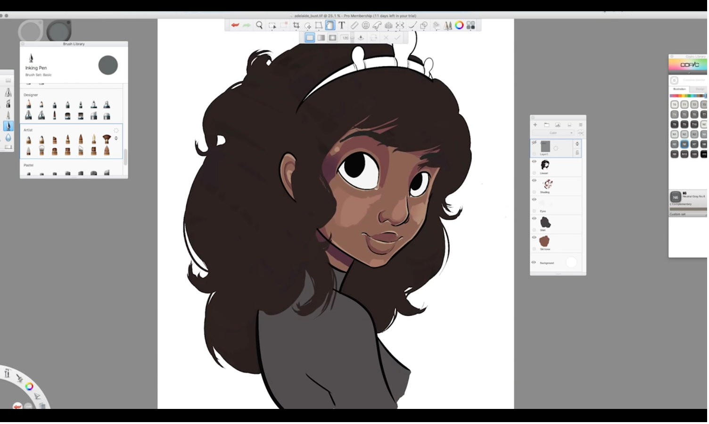

## Step Six - Blend Your Colors

After you've finished adding color to your illustration, your image will need some blending. You don't want your beautiful character you just created to have splotchy skin. This is why blending is so important. Blending can help your artwork appear more polished and can give the art more of a realistic feel to it. 

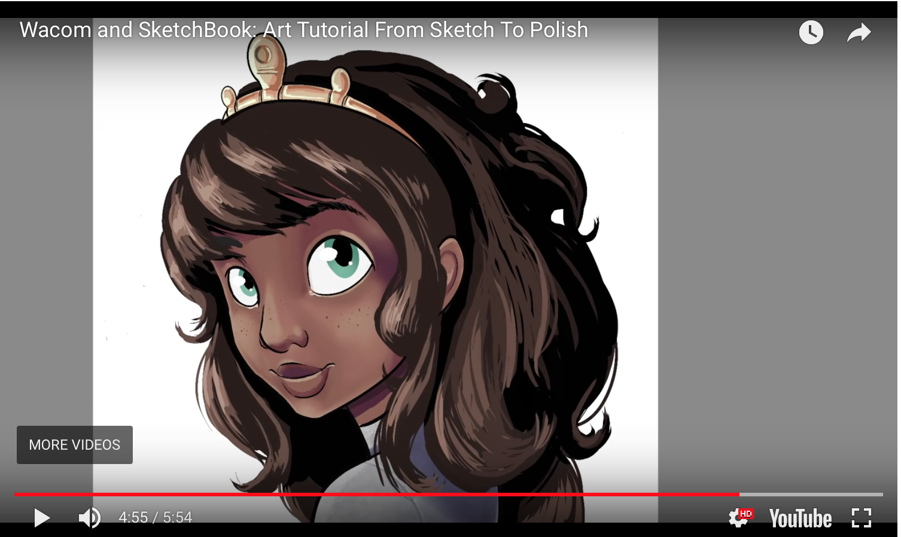

## We Are Finished!
VOILA! You have made it all the way through this tutorial! I can't believe you are still here. You just witnessed the beginning stages of a sketch, all the way through the finishing stages of a beautiful illustration. You now have all of the necessary knowledge to go make amazing art of your own. PRACTICE! PRACTICE! PRACTICE! Getting the hang of drawing with the tablet will take time, but before you know it you will be a pro! Thanks for stopping by!

### To watch the entire video of this illustration being made go to https://www.sketchbook.com/blog/wacom-intuos-sketchbook-workflow/

## Sources
https://www.techwalla.com/articles/how-to-set-up-a-wacom-tablet
https://community.wacom.com/inspiration/blog/2015/july/how-to-draw-in-adobe-illustrator-with-a-wacom-tablet
https://www.sketchbook.com/blog/wacom-intuos-sketchbook-workflow/
